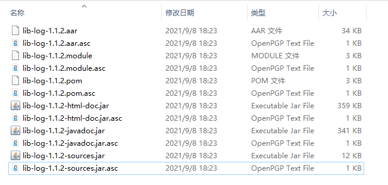

# MavenCentral发布指南

[](https://maven-badges.herokuapp.com/maven-central/io.github.maoqiqi/lib-log)
[](https://developer.android.com/about/versions/android-4.1.html)
[](http://www.apache.org/licenses/LICENSE-2.0)
[](fengqi.mao.march@gmail.com)

## Catalog

* [前言](#前言)
* [注册和激活](#注册和激活)
* [GPG使用](#GPG使用)
* [部署](#部署)
* [发布](#发布)
* [查看](#查看)
* [引用](#引用)
* [参考资料](#参考资料)
* [License](#License)

## 前言

相信不少朋友都有自己进行维护的作品，并托管在第三方仓库开放使用。

今年Jfrog宣布了这项决定：

> UPDATE: To better support the community in this migration,
> JFrog has extended the JCenter new package versions submission deadline through March 31st 2021.
> To clarify, the JCenter repository will keep serving packages for 12 months until February 1st 2022.
> Only the JCenter REST API and UI will be sunsetted on May 1st 2021.

> 更新：为了在这次迁移中更好地支持社区，
> JFrog 已将 JCenter 新软件包版本提交截止日期延长至 2021 年 3 月 31 日。
> 澄清一下，JCenter 存储库将继续提供包服务 12 个月，直到 2022 年 2 月 1 日。
> 只有 JCenter REST API 和 UI 将在 2021 年 5 月 1 日停用。

而距离Jcenter宣布停止对非付费用户的各项运营政策已经有一段时间了，随着时间的推移，未付费用户托管的Library将无法再被获取。再不行动起来，托管在Jcenter和Jfrog的Library就要没了。

## 注册和激活

### Sonatype简介

Sonatype OSSRH (OSS Repository Hosting) 使用 Sonatype Nexus Repository Manager 为开源项目二进制文件提供存储库托管服务。
你可以通过它发布快照(snapshot)或是稳定版(release)到Maven中央仓库。我们只要注册一个Sonatype的JIRA账号、创建一个JIRA ticket，然后对POM文件稍作配置即可。

### 创建您的JIRA帐户

**注册地址**:[https://issues.sonatype.org](https://issues.sonatype.org)，按照信息指导填写即可。

### 创建新项目工单


这里有几个需要注意的地方：

1. 项目:Community Support - Open Source Project Repository Hosting
2. 问题类型:New Project
3. 概要:描述项目功能，不重要
4. Group Id:比较重要
5. Project URL:填写自己开源项目地址即可，要与 Group Id 有一定的关联性

对于这里的 Group Id，它就是发布完成之后，引用时的 Group Id。我们需要先申请一个可用的GroupId。开始申请之前，请先阅读以下内容，避免无用操作：

> As stated in our article, choosing your coordinates, you must choose a groupId for a Web Domain that you own, or for which you are the designated maintainer on behalf of the owner. We also support personal sites
>
> * In the case of Github, Gitee, Bitbucket or similar groupIds (io.github.username), you must create a repository named OSSRH-TICKET NUMBER. Check the details in the Coordinates document.
> * For all other owned domains, be prepared to verify domain ownership via one of the following methods:
>   * Create a TXT record in your Domain Register Service referencing your OSSRH ticket number.
>   * Setup a redirect from your domain to the URL of the hosting service (Github, Gitee, Bitbucket, etc) where you are hosting your project.
> * You can find more information here: https://central.sonatype.org/publish/

按照sonatype的运营策略，他们利用了一些巧妙的方式来管理GroupId并且规避抢注风险。

首先分为两种类型：拥有域名和没有域名。
你可以使用自己的域名，但是需要证明域名是你自己的。
如果没用自己的域名，需要利用到第三方（如：Github、Gitlab、Gitee 等），通过第三方"对于其用户名的唯一性约束"和"Pages服务"，可以得到一个托管在三方平台的网站。
创建完之后几分钟内就会收到对方发送的邮件，然后按照邮件内容来验证激活。

> Please do not deploy until after you have received an e-mail notice indicating that the ticket is Resolved.
> One of the most common problems related to new projects is premature deployment, which results in build failures complaining about missing permissions.

> 在您收到表明故障单已解决的电子邮件通知之前，请不要部署。与新项目相关的最常见问题之一是过早部署，这会导致构建失败并抱怨缺少权限。

提交后等待，一般会先有机器人进行答复，告知你平台的运营政策、相关注意事项。

注意：不要一直盯着等待，注册时填写了邮箱，一旦流程状态发生了变更，会有邮件通知。

## GPG使用

### GPG是什么

* GPG是一个使用RSA算法加解密的软件。
* 有公网的公开仓库，可以上传公钥，供其他服务解密。简单说就是有公网的加解密服务。
* Sonatype要求推送的jar包要加密，并会根据信息去公网的仓库验证，成功才能发布。

### 申请密钥

这里需要一个GPG秘钥，需要下载GPG管理器客户端完成申请：

Windows 下载安装地址：[https://www.gpg4win.org/get-gpg4win.html](https://www.gpg4win.org/get-gpg4win.html)

此软件是支持中文的，请放心使用，如下图，点击不捐助，点击下载安装即可。


### 生成密钥

安装完毕之后，可以通过如下指令生成密钥：```gpg --generate-key```

创建密钥的过程中会要求输入密码，这里的密码非常重要，我们发布的时候会使用到它。

创建完毕之后可以通过 gpg -k 显示所有已创建的密钥：```gpg -k```

```
C:/Users/xxx/AppData/Roaming/gnupg/pubring.kbx
-----------------------------------------------------
pub   rsa3072 2021-05-17 [SC] [expires: 2023-05-17]
      XXXXXXXXXXXXXXXXXXXXXXXXXXXXXXXXXXXXXXXXX
uid           [ultimate] XXX <xxx@163.com>
sub   rsa3072 2021-05-17 [E] [expires: 2023-05-17]
```

这里的字符串 XXXXXXXXXXXXXXXXXXXXXXXXXXXXXXXXXXXXXXXXX 叫做密钥指纹。后面 8 位叫做 KEY ID，我们发布的时候将使用到它。

### 上传公钥到公共服务器

在 sonatype 的仓库提交后，需要从多个公钥服务器上下载匹配的公钥，然后来校验你上传的文件的签名。

使用的三个公共仓库地址，上传任意一个即可：

* keys.openpgp.org
* keyserver.ubuntu.com
* pool.sks-keyservers.net

```
gpg --keyserver hkp://keyserver.ubuntu.com --send-keys [密钥指纹]
```

检查是否上传成功：

```
gpg --keyserver hkp://keyserver.ubuntu.com --recv-keys [密钥指纹]
```

### 保存secret.gpg文件

进行文件签名的时候需要用到名为 secret.gpg 的文件，我们可以通过如下命令生成：```gpg --export-secret-keys [密钥指纹] > secret.gpg```

### 秘钥管理

上述所生成的密钥为了方便之后电脑重装或更换电脑不慎丢失等问题，请采用下列方式对密钥进行相应的处理，然后再把密钥文件进行妥善管理，切记，切记，切记！

* 导出公钥到 public-file.key 文件：```gpg -a -o public-file.key --export [密钥指纹]```

* 导出私钥到 private-file.key 文件：```gpg -a -o private-file.key --export-secret-keys [密钥指纹]```

* 导入公钥/私钥：```gpg --import public-file.key/private-file.key```

### GUI操作

#### 生成密钥

1.新建秘钥


2.点击第一个选项，创建个人秘钥


3.接下来输入你的账号、邮箱以及勾选 Protect the generated key with a passphrase


4.下一步，设置密码，完成

#### 上传公钥到公共服务器

在主界面双击你创建的秘钥，可以看到以下界面。


请记住下边红框圈住的8位字母，复制下来，一会要用。点击生成吊销证书按钮，保存下来你的吊销证书，然后回到主界面点击右键，在服务器发布。


#### 保存secret.gpg文件

接下来再次右键，点击导出，重命名导出文件后缀，导出为gpg格式的文件。

## 部署

### 配置

首先需要引入两个插件

```
plugins {
    id 'maven-publish' # 发布
    id 'signing' # 签名
}
```

### 配置生成JavaDoc和Sources的Task

```
// The following is the task of generating sources.jar and javadoc.jar

// This generates sources.jar
task sourcesJar(type: Jar) {
    // Specify the source code through the from function, which is the default source
    from android.sourceSets.main.java.srcDirs
    archiveClassifier.set("sources")
    // exclude "**/R.class"
    // exclude "**/BuildConfig.class"
}

// Set the Javadoc
// Android项目需要额外定义一下task,java-library等项目插件自带task
task javadoc(type: Javadoc) {
    source = android.sourceSets.main.java.srcDirs
    classpath += project.files(android.getBootClasspath().join(File.pathSeparator))
    options.encoding = "UTF-8"
    failOnError false
}

// This generates javadoc.jar, dependsOn here means that this task will only start after the javadoc complete.
task javadocJar(type: Jar, dependsOn: javadoc) {
    from javadoc.destinationDir
    archiveClassifier.set("javadoc")
}

task dokkaJavadocJar(type: Jar, dependsOn: dokkaJavadoc) {
    from "build/dokka/javadoc"
    archiveClassifier.set("javadoc")
}

task dokkaHtmlJar(type: Jar, dependsOn: dokkaHtml) {
    from "build/dokka/html"
    archiveClassifier.set("html-doc")
}
```

**注意**：Android项目需要额外定义一下task,java-library等项目插件自带task。

### 编写发布脚本

注意，在任务Evaluated之后进行配置，即配置在 afterEvaluate 闭包内。

```
afterEvaluate {
    publishing {
        publications {
            // Creates a Maven publication called "maven".
            maven(MavenPublication) {
                // Applies the component for the release build variant.
                from components.release
                // You can then customize attributes of the publication as shown below.
                groupId = mavenCentralGroupId
                artifactId = mavenCentralName
                version = mavenCentralVersion
                artifact sourcesJar
                // artifact javadocJar
                artifact dokkaJavadocJar
                artifact dokkaHtmlJar
                // 配置POM文件格式
                pom {
                    name = mavenCentralName
                    description = mavenCentralDesc
                    url = mavenCentralWebsite
                    licenses {
                        license {
                            name = 'The Apache License, Version 2.0'
                            url = 'http://www.apache.org/licenses/LICENSE-2.0.txt'
                        }
                    }
                    // 开发者信息
                    developers {
                        developer {
                            id = developerId
                            name = developerName
                            email = developerEmail
                        }
                    }
                    // 版本控制仓库地址
                    scm {
                        connection = mavenCentralScm
                        developerConnection = mavenCentralScm
                        url = mavenCentralScm
                    }
                }
            }
        }
        // 配置远程仓库
        repositories {
            maven {
                name = "mavencentral"
                // change URLs to point to your repos, e.g. http://my.org/repo
                // def releasesRepoUrl = layout.buildDirectory.dir('repos/releases')
                // def snapshotsRepoUrl = layout.buildDirectory.dir('repos/snapshots')
                // url = version.endsWith('SNAPSHOT') ? snapshotsRepoUrl : releasesRepoUrl
                url = 'https://s01.oss.sonatype.org/content/repositories/releases/'
                credentials {
                    // 这里就是之前在注册的账号密码
                    username ossrhUsername
                    password ossrhPassword
                }
            }
        }
    }

    signing {
        sign publishing.publications.maven
    }
}
```

**添加账户相关的信**

在 ~/gradle/gradle.properties 中添加账户相关的信：

```
signing.keyId=公钥ID，后八位即可
signing.password=GPG密钥的密码
signing.secretKeyRingFile=C\:\\Users\\xxx\\secret.gpg #钥匙串地址
```

比较遗憾的是目前没有在local.properties中配置的方法，似乎signing插件内部直接读取了属性。

考虑到密钥安全性，可以将gradle.properties文件从Git中移除并忽略。

## 发布

配置成功之后，按照下图运行 publishMavenPublicationToMavencentralRepository 就可以开始上传了，这样就可以将你的文件上传到 Maven Central 了。


发布之前我们可以先发布到本地，看一下对不对



## 查看

使用sonatype的账号密码登录[sonatype的maven仓库](https://s01.oss.sonatype.org/)，查看提交。

上述操作成功后，提交的应当已经进入sonatype仓库，大约1小时内同步到MavenCentral。

登录到自己的仓库之后点击左侧的 Staging Repositories 就可以看到我们刚刚发布的文件。


## 引用

发布完成之后就可以引用了，引用依赖的方式和其他仓库完全一样，需要注意的的是同步成功之前需要先添加 Maven Central 的仓库的地址。

```
repositories {
    //推荐: release成功后会直接从mavenCentral拉取aar
    mavenCentral()
    //或者
    maven {url "https://s01.oss.sonatype.org/content/groups/public"}
    //或者
    maven {url "https://s01.oss.sonatype.org/content/repositories/releases"}
}
```

## 参考资料

* [Maven Central Repository Search](https://search.maven.org)
* [The Central Repository Documentation](https://central.sonatype.org/pages/ossrh-guide.html)
* [Publishing your first Android library to MavenCentral](https://proandroiddev.com/publishing-your-first-android-library-to-mavencentral-be2c51330b88)
* [Android库发布到Maven Central全攻略](https://xiaozhuanlan.com/topic/6174835029)
* [MAVEN中央仓库JAR包发布全流程详解](https://www.freesion.com/article/45471417106/)

## License

```
   Copyright [2021] [March]

   Licensed under the Apache License, Version 2.0 (the "License");
   you may not use this file except in compliance with the License.
   You may obtain a copy of the License at

       http://www.apache.org/licenses/LICENSE-2.0

   Unless required by applicable law or agreed to in writing, software
   distributed under the License is distributed on an "AS IS" BASIS,
   WITHOUT WARRANTIES OR CONDITIONS OF ANY KIND, either express or implied.
   See the License for the specific language governing permissions and
   limitations under the License.
```
